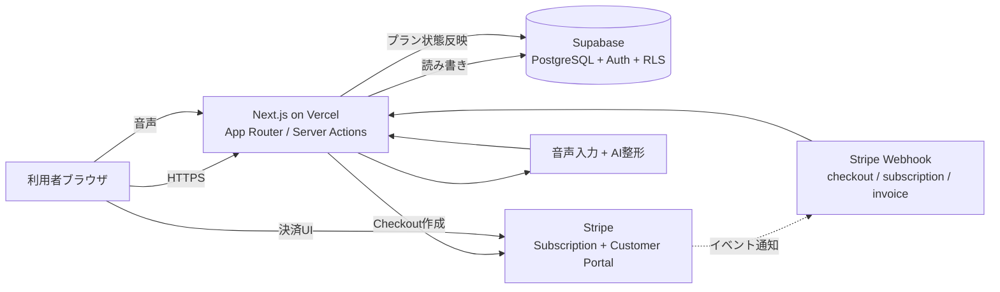
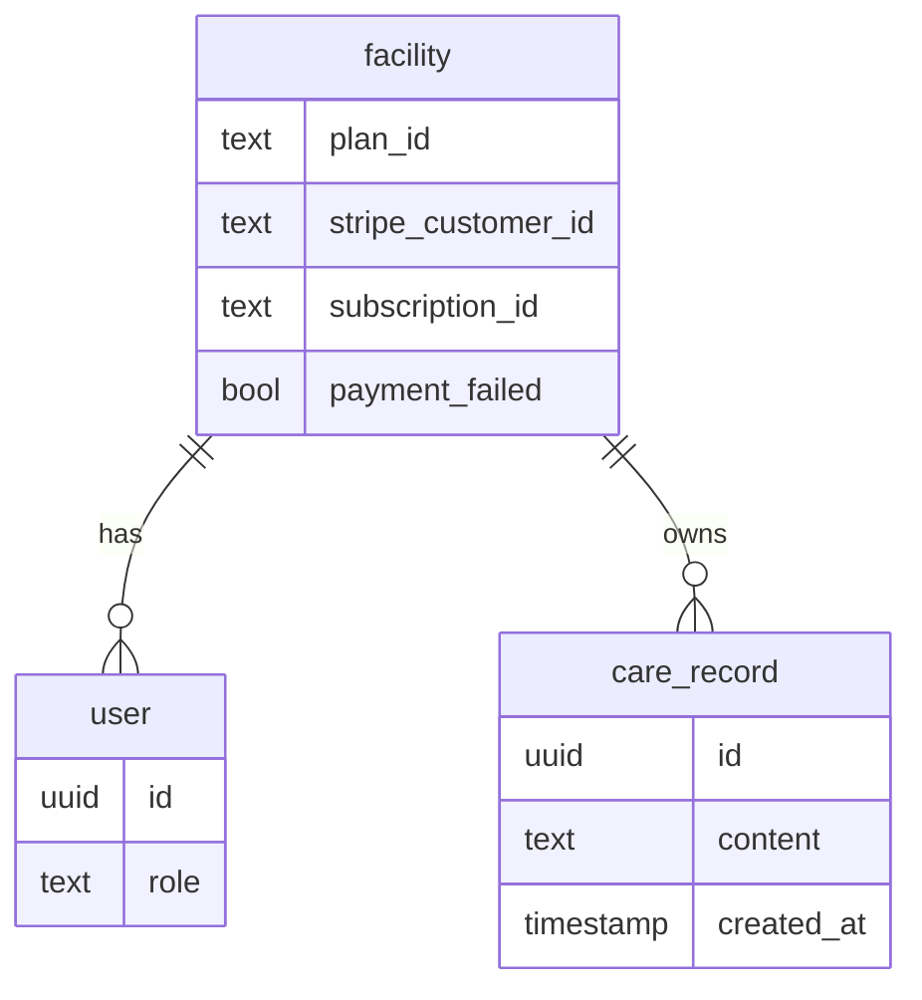

# 介護DXアシスト (kaigo-dx) — Case Study

> 介護記録AIアシスト — 話すだけで介護記録が完成するSaaS

このリポジトリは [kaigo-dx](https://kaigo-dx.vercel.app/) のケーススタディ(本体は private)。
サービス概要・アーキテクチャ・主要な技術選定の理由をまとめている。

> **Note**: 本体リポジトリには介護事業所の業務情報・契約情報を含むため非公開としている。
> 本ドキュメントはサービス全体像と設計判断を共有することを目的に作成している。

---

## TL;DR

- **何**: 介護現場の記録業務を音声入力 + AI で短縮するB2B SaaS
- **誰のため**: 介護事業所(中小規模を想定)。記録に時間を取られている現場職員と、それを管理する事業所
- **収益モデル**: 月額/年額のサブスクリプション(¥30,000〜¥80,000/月、年額20%割引)
- **スタック**: Next.js (App Router) / Supabase / Stripe / Vercel

---

## 課題と解決

### 課題
介護現場では一日の業務の中で「記録作成」が大きな時間を占めている。
手書き → PC入力という二度手間や、退勤前にまとめて記録する負担が常態化しており、
本来の対人ケアの時間を圧迫している。

### 解決アプローチ
「話すだけで介護記録が完成する」を中心に据え、音声入力 + AIによる文章整形で
記録作成にかかる時間を削減する。

### 主要機能
- 音声入力からの介護記録自動生成
- 事業所(facility)単位のマルチテナント管理
- プランベースのアクセス制御(フリー/スタンダード/エンタープライズ)
- Stripe を使ったサブスクリプション課金とプラン変更フロー

---

## デモ・スクリーンショット

🔗 **Live**: https://kaigo-dx.vercel.app/

<!-- スクショは後で差し込み。撮ったらこのコメントを消して以下を有効化 -->
<!--
| ランディング | 料金ページ | ダッシュボード |
|---|---|---|
|  |  |  |
-->

---

## アーキテクチャ

### データモデルの中核

事業所(facility)を中心に据え、ユーザーと介護記録は事業所配下にぶら下がる。
Stripe の `customer_id` / `subscription_id` も facility テーブルに集約することで、
「事業所単位での契約管理」というドメイン概念とインフラ層の認識が一致する。

---

## 主要な技術選定

### 1. Next.js App Router (Server Actions 中心) を採用

**他の選択肢**:
- (A) Pages Router で書く
- (B) Next.js + 別建ての REST/GraphQL API バックエンド
- (C) App Router + Server Actions ← 採用

**採用理由**:
- 個人開発で別建てバックエンドを運用するコストを払いたくない
- Server Actions により form の progressive enhancement が標準的に書ける
- Supabase クライアントを Server Component から直接呼べるため境界が単純

**この判断を見直すトリガー**:
- 他クライアント(ネイティブアプリ等)が必要になったタイミングで Route Handler 中心に再構築

### 2. Supabase + RLS (マルチテナント設計)

**他の選択肢**:
- (A) 自前で Postgres + Prisma + 認可ミドルウェア
- (B) Firebase
- (C) Supabase + Row Level Security ← 採用

**採用理由**:
- 介護事業所のデータ(利用者情報を含む可能性)を扱うため、認可漏れを構造的に防ぎたい
- RLS により「DBに直接クエリしても他事業所のデータが見えない」状態を保証できる
- Anon Key を露出してもポリシーで守られる設計
- 自前で認可ミドルウェアを書くと「実装漏れ」というリスクを永続的に抱える

**この判断を見直すトリガー**:
- スケール要件で読み込みパフォーマンスが厳しくなり、別の認可戦略が必要になったとき

### 3. Stripe Subscription + Customer Portal

**他の選択肢**:
- (A) Stripe Checkout のみで月額決済、プラン変更は申込フォームで受けて手動対応
- (B) 自前の請求書発行 + 銀行振込
- (C) Stripe Subscription + Customer Portal ← 採用

**採用理由**:
- B2B SaaS で「プラン変更・キャンセル」をユーザー自身が完結できる体験は重要
- Customer Portal を使えば、その UI を自前で書かずに済む
- Webhook の受け口を作っておくことで `payment_failed` 等の異常系を検知して
  facility テーブルに状態を持てる(これによりアプリ側で機能制限を一貫して扱える)

**この判断を見直すトリガー**:
- 大型契約・複数年契約・カスタム見積もりが主流になった場合は、
  Customer Portal だけでは足りず営業フローと連携する必要が出る

詳細な検討と採否は今後 ADR として書き起こす予定(本リポジトリ `docs/adr/` に追加)。

---

## 開発で意識していること

### ライト DDD の適用
ドメイン層(`lib/domain/`) - ユースケース層(`lib/usecase/`) - インフラ層(`lib/infrastructure/`)
の3層に分け、`app/` から Supabase クライアントを直接呼ばない方針を取っている。
個人開発なのでフル DDD は過剰だが、「介護事業所」「介護記録」「プラン」という
ドメイン用語をコードに落とすことで、後から読み返した時に判断の意図が再現できる。

### セキュリティ前提
- 全テーブルで RLS 有効化、開発時から本番想定でポリシーを書く
- `service_role key` はサーバー側(Server Actions / Webhook)のみ
- Stripe Webhook は署名検証を必須(`STRIPE_WEBHOOK_SECRET`)

### AI共同開発の透明化
本プロジェクトは Claude Code を活用して開発している。
「自分が決めたこと(設計判断・ドメイン定義)」と「AIに任せたこと(ボイラープレート・テスト追加)」
を分けて記録しており、後日 Zenn 等で公開予定。

---

## 技術スタック詳細

| カテゴリ | 採用技術 |
|---|---|
| Framework | Next.js 16 (App Router) |
| UI | React 19, Tailwind CSS 4 |
| Forms | react-hook-form + Zod |
| Auth & DB | Supabase (PostgreSQL, RLS) |
| 決済 | Stripe Subscription, Customer Portal, Webhook |
| デプロイ | Vercel |
| 開発支援 | Claude Code (CLI + Desktop) |

---

## ロードマップ(抜粋)

- [x] 認証 + マルチテナント基盤
- [x] Stripe Subscription 連携(月額/年額、プラン変更、キャンセル)
- [x] プランベースのアクセス制御
- [x] 音声入力 → AI記録生成フロー
- [ ] 事業所内チーム機能の強化
- [ ] 監査ログ
- [ ] エンタープライズ向けカスタム要件対応

---

## なぜこのリポジトリがあるのか

このリポジトリは「動いているものを面接や採用担当に見せたいが、本体は公開できない」
というジレンマへの回答として作っている。

- **ライブのプロダクト**: https://kaigo-dx.vercel.app/ で実物を触れる
- **設計判断の透明化**: ADR を後日追加し、なぜこの構成になったかを説明可能にする
- **継続的な改善ログ**: 大きな変更が入った時に本リポジトリの README も更新する

「コードは見えないが、何を考えて作ったかは分かる」状態を目指す。

---

## 連絡

- GitHub: [@takepon7](https://github.com/takepon7)
- 関連プロジェクト: [supplement-app](https://github.com/takepon7/supplement-app)(同 stack の個人向けアプリ)

## License

This case study (README and docs) is shared for portfolio/reference purposes.
The application source code is private.